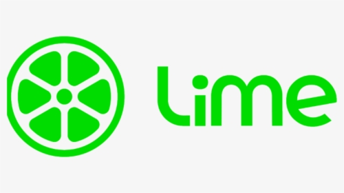
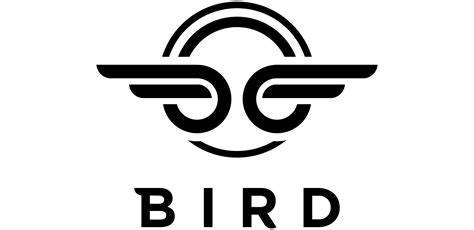

Universidad Peruana de Ciencias Aplicadas

Carrera: Ingeniería de Software

Ciclo: 2024-01

Curso: Aplicaciones Web

Sección: WX52

Profesor: Naldo Reupo-Musayon Gastulo

Informe del Trabajo Final

Startup: GoSteel

Producto: FastScooter

Integrantes:
- Apellido Apellido, Nombre Nombre
- Barrial Marin, Sharon Antuanet Ivet - U202114900
- Minaya Mundines, Pietro Minaya - U201718387
- Apellido Apellido, Nombre Nombre
- Apellido Apellido, Nombre Nombre

Junio del 2024

---
# Registro de Versiones del Informe

---
# Project Report Collaboration Insights

---
# Student Outcome
El curso contribuye al cumplimiento del Student Outcome ABET: **ABET – EAC - Student Outcome 5**   Criterio: *La capacidad de funcionar efectivamente en un equipo cuyos miembros juntos proporcionan liderazgo, crean un entorno de colaboración e inclusivo, establecen objetivos, planifican tareas y cumplen objetivos.*

En el siguiente cuadro se describe las acciones realizadas y enunciados de conclusiones por parte del grupo, que permiten sustentar el haber alcanzado el logro del ABET – EAC - Student Outcome 5.

| Criterio específico | Acciones realizadas | Conclusiones |
| - | - | - |
| Participa en equipos multidisciplinarios con eficacia, eficiencia y objetividad, en el marco de un proyecto en soluciones de ingeniería de software. | **Apellido Apellido Nombre Nombre**   ***TB1:*** Morbi vel tortor id eros dictum venenatis id ut dui.Mauris quis tellus sed nunc hendrerit vehicula ac id mauris.   ***TP:*** Morbi vel tortor id eros dictum venenatis id ut dui.Mauris quis tellus sed nunc hendrerit vehicula ac id mauris.   ***TB2:*** Morbi vel tortor id eros dictum venenatis id ut dui.Mauris quis tellus sed nunc hendrerit vehicula ac id mauris.   ***TF:*** Morbi vel tortor id eros dictum venenatis id ut dui.Mauris quis tellus sed nunc hendrerit vehicula ac id mauris.    **Apellido Apellido Nombre Nombre**   ***TB1:*** Morbi vel tortor id eros dictum venenatis id ut dui.Mauris quis tellus sed nunc hendrerit vehicula ac id mauris.   ***TP:*** Morbi vel tortor id eros dictum venenatis id ut dui.Mauris quis tellus sed nunc hendrerit vehicula ac id mauris.   ***TB2:*** Morbi vel tortor id eros dictum venenatis id ut dui.Mauris quis tellus sed nunc hendrerit vehicula ac id mauris.   ***TF:*** Morbi vel tortor id eros dictum venenatis id ut dui.Mauris quis tellus sed nunc hendrerit vehicula ac id mauris.    | ***TB1:*** Fusce cursus dolor et nulla suscipit, sit amet ullamcorper nibh vestibulum.    ***TP:*** Fusce cursus dolor et nulla suscipit, sit amet ullamcorper nibh vestibulum.    ***TB2:*** Fusce cursus dolor et nulla suscipit, sit amet ullamcorper nibh vestibulum.    ***TF:*** Fusce cursus dolor et nulla suscipit, sit amet ullamcorper nibh vestibulum. | 
| Conoce al menos un sector empresarial o dominio de aplicación de soluciones de software. | ***Apellido Apellido Nombre Nombre***   ***TB1:*** Cras sed diam suscipit, malesuada ex rutrum, fringilla orci. Vestibulum in nunc quis elit suscipit sollicitudin.   ***TP:*** Cras sed diam suscipit, malesuada ex rutrum, fringilla orci. Vestibulum in nunc quis elit suscipit sollicitudin.   ***TB2:*** Cras sed diam suscipit, malesuada ex rutrum, fringilla orci. Vestibulum in nunc quis elit suscipit sollicitudin.   ***TF:*** Cras sed diam suscipit, malesuada ex rutrum, fringilla orci. Vestibulum in nunc quis elit suscipit sollicitudin.    ***Apellido Apellido Nombre Nombre***   ***TB1:*** Cras sed diam suscipit, malesuada ex rutrum, fringilla orci. Vestibulum in nunc quis elit suscipit sollicitudin.   ***TP:*** Cras sed diam suscipit, malesuada ex rutrum, fringilla orci. Vestibulum in nunc quis elit suscipit sollicitudin.   ***TB2:*** Cras sed diam suscipit, malesuada ex rutrum, fringilla orci. Vestibulum in nunc quis elit suscipit sollicitudin.   ***TF:*** Cras sed diam suscipit, malesuada ex rutrum, fringilla orci. Vestibulum in nunc quis elit suscipit sollicitudin. | ***TB1:*** FEtiam imperdiet quam condimentum velit tempor porttitor.    ***TP:*** FEtiam imperdiet quam condimentum velit tempor porttitor.    ***TB2:*** FEtiam imperdiet quam condimentum velit tempor porttitor.    ***TF:*** FEtiam imperdiet quam condimentum velit tempor porttitor. |

---
# Contenido 
## Tabla de contenidos

### [Capítulo I: Introducción]()
- [1.1. Startup Profile]()
    - [1.1.1 Descripción de la Startup]()
    - [1.1.2 Perfiles de integrantes del equipo]()
- [1.2 Solution Profile]()
    - [1.2.1 Antecedentes y problemática]()
    - [1.2.2 Lean UX Process]()
        - [1.2.2.1. Lean UX Problem Statements]()
        - [1.2.2.2. Lean UX Assumptions]()
        - [1.2.2.3. Lean UX Hypothesis Statements]()
        - [1.2.2.4. Lean UX Canvas]()
- [1.3. Segmentos objetivo]()

### [Capítulo II: Requirements Elicitation & Analysis]()
- [2.1. Competidores]()
    - [2.1.1. Análisis competitivo]()
    - [2.1.2. Estrategias y tácticas frente a competidores]()
- [2.2. Entrevistas]()
    - [2.2.1. Diseño de entrevistas]()
    - [2.2.2. Registro de entrevistas]()
    - [2.2.3. Análisis de entrevistas]()
- [2.3. Needfinding]()
    - [2.3.1. User Personas]()
    - [2.3.2. User Task Matrix]()
    - [2.3.3. User Journey Mapping]()
    - [2.3.4. Empathy Mapping]()
    - [2.3.5. As-is Scenario Mapping]()
- [2.4. Ubiquitous Language]()

### [Capítulo III: Requirements Specification]()
- [3.1. To-Be Scenario Mapping]()
- [3.2. User Stories]()
- [3.3. Impact Mapping]()
- [3.4. Product Backlog]()

### [Capítulo IV: Product Design]()
- [4.1. Style Guidelines]()
    - [4.1.1. General Style Guidelines]()
    - [4.1.2. Web Style Guidelines]()
- [4.2. Information Architecture]()  
    - [4.2.1. Organization Systems]()
    - [4.2.2. Labeling Systems]()
    - [4.2.3. SEO Tags and Meta Tags]()
    - [4.2.4. Searching Systems]()
    - [4.2.5. Navigation Systems]()
- [4.3. Landing Page UI Design]()
    - [4.3.1. Landing Page Wireframe]()
    - [4.3.2. Landing Page Mock-up]()
- [4.4. Web Applications UX/UI Design]()
    - [4.4.1. Web Applications Wireframes]()
    - [4.4.2. Web Applications Wireflow Diagrams]()
    - [4.4.3. Web Applications Mock-ups]()
    - [4.4.4. Web Applications User Flow Diagrams]()
- [4.5. Web Applications Prototyping]()
- [4.6. Domain-Driven Software Architecture]()
    - [4.6.1. Software Architecture Context Diagram]()
    - [4.6.2. Software Architecture Container Diagrams]()
    - [4.6.3. Software Architecture Components Diagrams]()
- [4.7. Software Object-Oriented Design]()
    - [4.7.1. Class Diagrams]()
    - [4.7.2. Class Dictionary]()
- [4.8. Database Design]()
    - [4.8.1. Database Diagram]()

### [Capítulo V: Product Implementation, Validation & Deployment]()
- [5.1. Software Configuration Management]()
    - [5.1.1. Software Development Environment Configuration]()
    - [5.1.2. Source Code Management]()
    - [5.1.3. Source Code Style Guide & Conventions]()
    - [5.1.4. Software Deployment Configuration]()
- [5.2. Landing Page, Services & Applications Implementation]()
    - [5.2.1. Sprint 1]()
        - [5.2.1.1. Sprint Planning 1]()
        - [5.2.1.2. Sprint Backlog 1]()
        - [5.2.1.3. Development Evidence for Sprint Review]()
        - [5.2.1.4. Testing Suite Evidence for Sprint Review]()
        - [5.2.1.5. Execution Evidence for Sprint Review]()
        - [5.2.1.6. Services Documentation Evidence for Sprint Review]()
        - [5.2.1.7. Software Deployment Evidence for Sprint Review]()
        - [5.2.1.8. Team Collaboration Insights during Sprint]()
    - [5.2.2. Sprint 2]()
        - [5.2.2.1. Sprint Planning 2]()
        - [5.2.2.2. Sprint Backlog 2]()
        - [5.2.2.3. Development Evidence for Sprint Review]()
        - [5.2.2.4. Testing Suite Evidence for Sprint Review]()
        - [5.2.2.5. Execution Evidence for Sprint Review]()
        - [5.2.2.6. Services Documentation Evidence for Sprint Review]()
        - [5.2.2.7. Software Deployment Evidence for Sprint Review]()
        - [5.2.2.8. Team Collaboration Insights during Sprint]()
    - [5.2.3. Sprint 3]()
        - [5.2.3.1. Sprint Planning 3]()
        - [5.2.3.2. Sprint Backlog 3]()
        - [5.2.3.3. Development Evidence for Sprint Review]()
        - [5.2.3.4. Testing Suite Evidence for Sprint Review]()
        - [5.2.3.5. Execution Evidence for Sprint Review]()
        - [5.2.3.6. Services Documentation Evidence for Sprint Review]()
        - [5.2.3.7. Software Deployment Evidence for Sprint Review]()
        - [5.2.3.8. Team Collaboration Insights during Sprint]()
    - [5.2.4. Sprint 4]()
        - [5.2.4.1. Sprint Planning 4]()
        - [5.2.4.2. Sprint Backlog 4]()
        - [5.2.4.3. Development Evidence for Sprint Review]()
        - [5.2.4.4. Testing Suite Evidence for Sprint Review]()
        - [5.2.4.5. Execution Evidence for Sprint Review]()
        - [5.2.4.6. Services Documentation Evidence for Sprint Review]()
        - [5.2.4.7. Software Deployment Evidence for Sprint Review]()
        - [5.2.4.8. Team Collaboration Insights during Sprint]()
- [5.3. Validation Interviews]()
    - [5.3.1. Diseño de Entrevistas]()
    - [5.3.2. Registro de Entrevistas]()
    - [5.3.3. Evaluaciones según heurísticas]()
- [5.4. Video About-the-Product]()

---
# Capítulo I: Introducción
## 1.1. Startup Profile
### 1.1.1 Descripción de la Startup
GoSteel: Simplificando la movilidad urbana con FastScooter

<ins>**Misión:**</ins>
En GoSteel, nuestra misión es proporcionar soluciones de movilidad eficientes y sostenibles para empresas de todos los tamaños. Nos comprometemos a ofrecer un servicio de renta de scooters eléctricos empresariales, FastScooter, que permita a nuestros clientes optimizar sus desplazamientos, reducir costos operativos y contribuir positivamente al medio ambiente.

<ins>**Visión:**</ins>
Nuestra visión en GoSteel es liderar la transformación del transporte urbano, ofreciendo una alternativa innovadora y ecoamigable a los métodos de movilidad tradicionales. Nos esforzamos por convertirnos en socios estratégicos de los transeuntes, brindándoles soluciones de movilidad flexibles y personalizadas que impulsen su crecimiento, eficiencia y sostenibilidad a largo plazo.

<ins>**Valores:**</ins>
1. **Sostenibilidad Ambiental:** Nos comprometemos a promover prácticas de movilidad sostenibles y respetuosas con el medio ambiente, contribuyendo activamente a la reducción de emisiones de carbono y la preservación de recursos naturales.
2. **Innovación Tecnológica:** Buscamos constantemente innovar y mejorar nuestros servicios, aprovechando tecnologías avanzadas para ofrecer una experiencia de movilidad eficiente, segura y conveniente.
3. **Excelencia en el Servicio al Cliente: ** Priorizamos la satisfacción y el éxito de nuestros clientes, brindándoles un servicio de alta calidad, atención personalizada y soluciones adaptadas a sus necesidades específicas.
4. **Transparencia y Confianza:** Actuamos con integridad y transparencia en todas nuestras operaciones, estableciendo relaciones de confianza y colaboración tanto con nuestros clientes como con nuestros colaboradores y socios comerciales.
5. **Responsabilidad Social Corporativa:** Nos comprometemos a ser agentes de cambio positivo en nuestras comunidades, apoyando iniciativas sociales y ambientales que contribuyan al bienestar y desarrollo sostenible de la sociedad en su conjunto.

Con FastScooter, en GoSteel estamos comprometidos a proporcionar a las transeuntes una solución de movilidad ágil, eficiente y ecológica que les permita optimizar sus rutas y promover un futuro más sostenible para todos.

### 1.1.2 Perfiles de integrantes del equipo

Nombre completo: Sharon Antuanet Ivet Barrial Marin 

Código de estudiante: U202114900

Carrera: Ingeniería de Software

Acerca de mí: Soy una estudiante que se caracteriza por poseer cualidades como la perseverencia, el compañerismo y la comunicación interpersonal. Además de tener conocimientos en diversos lenguajes de programación (Python, C++, C#...), también tengo habilidades en la edición de fotos y videos, y en el enfoque al marketing digital. Espero que estas pocas cualidades sirvan como aporte al proyecto durante el presente ciclo y curso.

Nombre completo: Pietro Gerardo Minaya Mundines 

Código de estudiante: U201718387

Carrera: Ingeniería de Software

Acerca de mí: Soy un apasionado por la tecnologia y me apasiona el Ajedrez.

## 1.2 Solution Profile
### 1.2.1 Antecedentes y problemática

### 1.2.2 Lean UX Process
#### 1.2.2.1. Lean UX Problem Statements

#### 1.2.2.2. Lean UX Assumptions

#### 1.2.2.3. Lean UX Hypothesis Statements

#### 1.2.2.4. Lean UX Canvas

## 1.3. Segmentos objetivo

>**Empresas delivery**

Las empresas delivery o con servicio delivery en Lima metropolitana son un enfoque importante para nuestro producto, ya que *FastScooter* les da como beneficio la **eficiencia en la entrega**. Debido a que los scooters son vehículos pequeños y ágiles, consiguen acceder a áreas de la ciudad a las que los automóviles no pueden llegar fácilmente haciendo que las entregas sean más rápidas y cumplan con los plazos acordados sin que el tráfico congestionado de Lima Metropolitana sea un problema.

Asimismo, resuelve el problema de la **reducción de costos operativos**, puesto que al hacer uso de scooters en lugar de vehículos más grandes ocasionan que los costos operativos asociados con el mantenimiento y el combustible disminuya, lo que puede ser beneficioso para las empresas de entrega en términos de rentabilidad. A su vez, alquilar scooters en lugar de comprarlos puede proporcionar a las empresas de entrega la flexibilidad de aumentar o reducir su flota según la demanda, lo que les permite ajustarse a los cambios estacionales o a las fluctuaciones en la demanda del mercado.

Además de estas razones empresariales, también existe una mejora en la **sostenibilidad ambiental**. El uso de scooters eléctricos produce bajas emisiones de polución lo que ayuda a reducir la huella de carbono de las operaciones de entrega de la empresa y esto es un punto de venta importante para aquellas empresas que buscan mejorar su imagen y compromiso con el ambiente.

>**Personas que transitan Lima Metropolitana**

Aunque *FastScooter* está disponible a todo público bajo su propia responsalidad, nuestro enfoque primordial son las personas que se movilizan por Lima Metropolitana de 18 a 30 años de edad, cuando cumplen la mayoría de edad y en general tienden a movilizarse por sí solos. En este tipo de casos, los scooters son una solución viable de **transporte alternativo** en las áreas urbanas, donde abunda los problemas de congestión de tráfico y estacionamiento limitado. El alquiler de scooters ofrece una solución de movilidad alternativa que es más rápida y flexible que el transporte público y más económica que el uso de un automóvil o taxi.

Además, al ser un servicio *eco-friendly*, aporta al **cuidado de nuestro medio ambiente**, debido a que reduce las emisiones de carbono y la creciete polución que crean los vehículos de combustión interna en la actualidad. Asimismo, y debido a la creciente toma de conciencia ambiental en los últimos años, ha hecho que muchas personas hagan uso de scooters eléctricos, fomentando un estilo de vida más respetuoso con el medio ambiente.

Por otro lado, según RPP (2020), la mayoría de los ciudadanos no poseen un vehículo propio y en comparación con otros países de Latianoamérica, Perú cuenta con una cantidad de autos menor al promedio. El alquiler de scooters es una opción conveniente y flexible para desplazarse por la ciudad. Pueden usar los scooters para viajes cortos o esporádicos sin la necesidad de comprometerse con la propiedad y el mantenimiento de un vehículo.

Por último, la renta de scooters estimula el turismo en la **realización de actividades** recreativas entre Los residentes locales y turistas, desde paseos por el vecindario a visitas a parques locales o exploración de lugares de interés turístico dentro de la ciudad.

# Capítulo II: Requirements Elicitation & Analysis
## 2.1 Competidores

***Lime:*** Una de las empresas líderes en el alquiler de scooters eléctricos. Opera en varias ciudades de todo el mundo y se ha convertido en una opción popular para la movilidad urbana.

***Bird:*** Empresa importante en este sector. Ofrece scooters eléctricos para alquilar en áreas urbanas. Su presencia global y su enfoque en la sostenibilidad los hacen destacar.

***Voi:*** es otra empresa importante en este sector. Ofrece scooters eléctricos para alquilar en áreas urbanas. Su presencia global y su enfoque en la sostenibilidad los hacen destacar.

### 2.1.1 Análisis competitivo
<table border="1" style="text-align: center;">
	<tbody>
		<tr>
			<td colspan="6">Competitive Analysis Landscape</td>
		</tr>
		<tr>
			<td colspan="2">¿Por que llevar a cabo este análisis?</td>
			<td colspan="4">Llevar a cabo este análisis nos brindará información crítica que nos permitirá tomar decisiones más informadas y estratégicas para el desarrollo, comercialización y crecimiento de nuestra aplicación</td>
		</tr>
		<tr>
			<td colspan="2"></td>
			<td>GoSteel</td>
			<td>Lime</td>
			<td>Bird</td>
			<td>Voi</td>
		</tr>
		<tr>
			<td rowspan="2">Perfil</td>
			<td>Overview</td>
			<td>Aplicación web diseñada para el alquiler de scooters</td>
			<td>Aplicación web diseñada para la compra/alquiler de scooters</td>
			<td>Aplicación web diseñada para la compra/alquiler de scooters</td>
			<td>Aplicación web diseñada para la compra/alquiler de scooters</td>
		</tr>
		<tr>
			<td>Ventaja competitiva ¿Que valor ofrece a los clientes?</td>
			<td>Ser una plataforma que ofrece </td>
			<td>Ser una plataforma que facilita  </td>
			<td>Ser una plataforma que proporciona </td>
			<td>Ser una plataforma que administra </td>
		</tr>
		<tr>
			<td rowspan="2">Perfil de Marketing</td>
			<td>Mercado objetivo</td>
			<td>
                <ul>
                    <li>Segmento Objetivo 1</li>
                    <li>Segmento Objetivo 2</li>
                </ul>
            </td>
			<td>
                <ul>
                    <li>Segmento Objetivo 1</li>
                    <li>Segmento Objetivo 2</li>
                </ul>
            </td>
			<td>
                <ul>
                    <li>Segmento Objetivo 1</li>
                    <li>Segmento Objetivo 2</li>
                </ul>
            </td>
			<td>
                <ul>
                    <li>Segmento Objetivo 1</li>
                    <li>Segmento Objetivo 2</li>
                </ul>
            </td>
		</tr>
		<tr>
			<td>Estrategias de marketing</td>
			<td>
                <ul>
                    <li>Marketing de contenido</li>
                    <li>Página web</li>
                </ul>
            </td>
			<td>
                <ul>
                    <li>Marketing de contenido</li>
                    <li>Página web</li>
                </ul>
            </td>
			<td>
                <ul>
                    <li>Marketing de contenido</li>
                    <li>Página web</li>
                </ul>
            </td>
			<td>
                <ul>
                    <li>Marketing de contenido</li>
                    <li>Página web</li>
                </ul>
            </td>
		</tr>
		<tr>
			<td rowspan="3">Perfil de Producto</td>
			<td>Productos &amp; Servicios</td>
			<td>
                <ul>
                    <li>Aplicación web</li>
                </ul>
            </td>
			<td>
                <ul>
                    <li>Aplicación web</li>
                </ul>
            </td>
			<td>
                <ul>
                    <li>Aplicación web</li>
                </ul>
            </td>
			<td>
                <ul>
                    <li>Aplicación web</li>
                </ul>
            </td>
		</tr>
		<tr>
			<td>Precios &amp; Costos</td>
			<td>
                <ul>
                    <li>Plataforma de Pago</li>
                </ul>
            </td>
			<td>
                <ul>
                    <li>Plataforma de Pago</li>
                </ul>
            </td>
			<td>
                <ul>
                    <li>Plataforma de Pago</li>
                </ul>
            </td>
			<td>
                <ul>
                    <li>Plataforma de Pago</li>
                </ul>
            </td>
		</tr>
		<tr>
			<td>Canales de distribución (Web y/o Móvil)</td>
			<td>
                <ul>
                    <li>Aplicación web</li>
                </ul>
            </td>
			<td>
                <ul>
                    <li>Aplicación web</li>
                </ul>
            </td>
			<td>
                <ul>
                    <li>Aplicación web</li>
                </ul>
            </td>
			<td>
                <ul>
                    <li>Aplicación web</li>
                </ul>
            </td>
		</tr>
		<tr>
			<td rowspan="4">Análisis SWOT</td>
			<td>Fortalezas</td>
			<td>
                <ul>
                    <li></li>
                    <li>Actualizaciones continuas</li>
                </ul>
            </td>
			<td>
                <ul>
                    <li>Precios transparentes</li>
                    <li>Permite la comunicación entre interesados</li>
                </ul>
            </td>
			<td>
                <ul>
                    <li>Optimiza las rutas cada día siendo más eficiente</li>
                </ul>
            </td>
			<td>
                <ul>
                    <li>Brinda capacidad de administrar todos los aspectos del alquiler</li>
                </ul>
            </td>
		</tr>
		<tr>
			<td>Debilidades</td>
			<td>
                <ul>
                    <li>Carece de ciertas características específicas</li>
                </ul>
            </td>
			<td>
                <ul>
                    <li>Plataforma poco intuitiva</li>
                </ul>
            </td>
			<td>
                <ul>
                    <li>Precio de renta elevados</li>
                </ul>
            </td>
			<td>
                <ul>
                    <li>Tiene un costo muy alto para lo que ofrece</li>
                </ul>
            </td>
		</tr>
		<tr>
			<td>Oportunidades</td>
			<td>
                <ul>
                    <li>Expansión de la plataformaa mercados internacionales</li>
                </ul>
            </td>
			<td>
                <ul>
                    <li>Mejores condiciones de uso en la aplicación</li>
                </ul>
            </td>
			<td>
                <ul>
                    <li>Reputacion</li>
                    <li>Buen reconocimiento</li>
                </ul>
            </td>
			<td>
                <ul>
                    <li>Funciona correctamente para ayudar a los interesados</li>
                </ul>
            </td>
		</tr>
		<tr>
			<td>Amenazas</td>
			<td>
                <ul>
                    <li>Presencia de competidores estalecidos</li>
                </ul>
            </td>
			<td>
                <ul>
                    <li>App similar</li>
                </ul>
            </td>
			<td>
                <ul>
                    <li>App similar</li>
                </ul>
            </td>
			<td>
                <ul>
                    <li>App similar</li>
                </ul>
            </td>
		</tr>
	</tbody>
</table>

### 2.1.2. Estrategias y tácticas frente a competidores
- CALIDAD: Después de estudiar a nuestros competidores en el mercado de alquiler de scooters, hemos identificado que uno de los principales problemas que enfrentan es la falta de mantenimiento de sus aplicaciones web, lo que resulta en numerosas quejas por errores frecuentes y tiempos de carga prolongados. Para diferenciarnos y obtener una ventaja competitiva, nos enfocaremos en optimizar los tiempos de carga de nuestra aplicación web y garantizar una experiencia sin inconvenientes para el usuario, abordando temas de disponibilidad, funcionalidad y accesibilidad.
- MARKETING: Al analizar el caso de "Lime" en relación con la popularidad en el mercado de alquiler de scooters, hemos observado que uno de sus principales desafíos radica en su limitado alcance y la falta de estrategias de marketing digital efectivas. Su dependencia de un modelo de publicidad insuficiente ha obstaculizado su crecimiento y ha dificultado ofrecer una solución sostenible a largo plazo para sus problemas. Para evitar este obstáculo, nos centraremos en implementar estrategias de marketing digital sólidas que amplíen nuestro alcance y promuevan de manera efectiva nuestros servicios de alquiler de scooters en el mercado."

## 2.2. Entrevistas
### 2.2.1. Diseño de entrevistas
Segmento Objetivo 1 (Usuario Scooter)
1. ¿Con qué frecuencia utilizas scooters como medio de transporte?
2. ¿Cuáles crees que son los principales beneficios de usar scooters en comparación con otros medios de transporte, como automóviles o bicicletas?
3. ¿Has experimentado algún desafío o limitación al usar scooters en tu distrito?
4. ¿Qué características valoras más al alquilar un scooter, como la comodidad, la velocidad o la autonomía de la batería?
5. ¿Has utilizado servicios de alquiler de scooters antes? Si es así, ¿cómo ha sido tu experiencia general?
6. ¿Hay aspectos específicos que hayas encontrado especialmente positivos o negativos al utilizar servicios de alquiler de scooters?
7. ¿Hay aspectos específicos que hayas encontrado especialmente positivos o negativos al utilizar servicios de alquiler de scooters?
8. ¿Qué características te gustaría ver en una aplicación de alquiler de scooters para que sea más fácil y conveniente para ti?
9. ¿Qué medidas de seguridad consideras importantes al alquilar y usar scooters, tanto para ti como para otros usuarios y peatones?
10. ¿Crees que seguirás utilizando scooters como medio de transporte en el futuro?

### 2.2.2. Registro de entrevistas

Segmento Objetivo: Segemento Objetivo 1

Entrevistado: 1

Nombre y apellidos: Luis Carbajal

Edad: 20

Distrito: San Isidro

[URL: Entrevista](https://upcedupe-my.sharepoint.com/:v:/g/personal/u201718387_upc_edu_pe/EcP3udKBWfNMoRhxyVpas0MBwYe2gqcMm4UizBRFioqaGg?nav=eyJyZWZlcnJhbEluZm8iOnsicmVmZXJyYWxBcHAiOiJPbmVEcml2ZUZvckJ1c2luZXNzIiwicmVmZXJyYWxBcHBQbGF0Zm9ybSI6IldlYiIsInJlZmVycmFsTW9kZSI6InZpZXciLCJyZWZlcnJhbFZpZXciOiJNeUZpbGVzTGlua0NvcHkifX0&e=MtI3Vr)

Resumen: El entrevistado utiliza scooters varias veces a la semana, especialmente para distancias cortas en áreas urbanas congestionadas, destacando su conveniencia y agilidad en comparación con otros medios de transporte. Sin embargo, señala desafíos como la disponibilidad y el estado de los scooters, así como problemas de infraestructura vial. Valora la comodidad, seguridad y autonomía de la batería al alquilar un scooter, y ha tenido experiencias mixtas con servicios de alquiler, destacando la disponibilidad y la falta de mantenimiento como aspectos positivos y negativos. Espera ver en una aplicación de alquiler de scooters una interfaz intuitiva y datos en tiempo real sobre la disponibilidad. Considera importante el mantenimiento y el respeto a las normas de seguridad para todos los usuarios y peatones, y planea seguir utilizando scooters como medio de transporte en el futuro debido a su conveniencia y sostenibilidad.

---

### 2.2.3. Análisis de entrevistas

 Segemento Objetivo 1:  
- Frecuencia de uso de scooters: El entrevistado utiliza scooters varias veces a la semana, lo que indica una alta frecuencia de uso y dependencia de este medio de transporte.
- Beneficios de los scooters: Destaca la conveniencia y agilidad de los scooters para moverse en áreas urbanas congestionadas, así como su economía y eco-amigabilidad en comparación con otros medios de transporte.
- Desafíos y limitaciones: Señala desafíos como la disponibilidad y el estado de los scooters, así como problemas con la infraestructura vial, lo que sugiere áreas de mejora en el servicio de alquiler de scooters y la planificación urbana.
- Características valoradas en un scooter: Valora la comodidad, seguridad y autonomía de la batería al alquilar un scooter, lo que resalta la importancia de estos aspectos para la satisfacción del usuario.
- Experiencia con servicios de alquiler de scooters: Ha tenido experiencias mixtas con servicios de alquiler, destacando aspectos positivos como la disponibilidad y negativos como la falta de mantenimiento.
- Expectativas de una aplicación de alquiler de scooters: Espera una aplicación intuitiva y con datos en tiempo real sobre la disponibilidad de scooters, lo que resalta la importancia de la tecnología en la mejora de la experiencia del usuario.
- Medidas de seguridad: Considera importante el mantenimiento y el respeto a las normas de seguridad, lo que subraya la necesidad de garantizar la seguridad tanto para los usuarios como para los peatones.
- Futuro uso de scooters: Planea seguir utilizando scooters como medio de transporte en el futuro debido a su conveniencia y sostenibilidad, lo que indica una tendencia a largo plazo en el uso de este medio de transporte.

Segemento Objetivo 2: 

## 2.3. Needfinding
### 2.3.1. User Personas

### 2.3.2. User Task Matrix

### 2.3.3. User Journey Mapping

### 2.3.4. Empathy Mapping

### 2.3.5. As-is Scenario Mapping

## 2.4. Ubiquitous Language

# Conclusiones
### Conclusiones y recomendaciones
### Video About-the-Team

---
# Bibliografía

   Ecobnb. (2022). *Todo lo que tienes que saber sobre los medios de transporte sostenibles en el turismo.* Recuperado de **[Ecobnb](https://es.ecobnb.com/blog/2022/09/medios-transporte-sostenibles-turismo/)** [Consulta: 28 de marzo del 2024]

   RPP. (2020). *¿La cantidad de autos es el problema en el tráfico de Lima?* Recuperado de **[RPP](https://rpp.pe/lima/actualidad/la-cantidad-de-autos-es-el-problema-en-el-trafico-de-lima-noticia-1248078?ref=rpp)** [Consulta: 28 de marzo del 2024]

   Stakeholders. (2021). *Delivery cero emisiones: Tottus realiza sus repartos a domicilio con vehículos sostenibles.* Recuperado de **[Stakeholders](https://stakeholders.com.pe/medio-ambiente/delivery-cero-emisiones-tottus-realiza-sus-repartos-a-domicilio-con-vehiculos-sostenibles/)** [Consulta: 28 de marzo del 2024]

---
# Anexos
